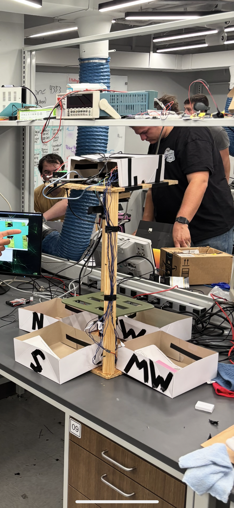

#   Letter Sorter

A [TTU Whitacre College of Engineering](https://www.depts.ttu.edu/coe/) ECE-3332 Microcontrollers project
 

## Description

The Letter Sorter system autonomously sorts letters in 4 region boxes approximating a distributor for regional post offices.
### Dependencies
#### OCR Model Cloud Deploymnet 
* OpenCV
* Fastapi
* Pillow
* Numpy
* Regex
* PaddleOCR
* paddlepaddle

#### Master controller
* Requests
* OpenCV
* Threading
* Serial
* Difflib

#### Low Level Sorting Controller
* Servo library
  
### Overview

### Hardware

#### Master controller
* Jetson Nano
* Wyrestorm Web cam
* Waveshare UPS Battery Pack

  
#### Low Level Sorting Control
* Arduino Uno 
* 2 X Servos
* IR Proximity Sensor

### Software

## Meet The Team

Samuel Kalu (OCR Cloud & Linux Development)
  
* Email : [samkalu@ttu.edu](mailto:samkalu@ttu.edu)
* [Linkedin](https://www.linkedin.com/in/samuel-kalu-74a359342/)

Josiah Horn (Embedded Software and Hardware Development)
* Email : [josihorn@ttu.edu](mailto:josihorn@ttu.edu)

## Acknowledgments

### Special thanks to Professor Mark Haustein
* [TTU WCOE ECE Department](https://www.depts.ttu.edu/ece/)
### Inspiration, code snippets, etc.
#### Nvidia Forums
* [UART](https://forums.developer.nvidia.com/t/how-to-use-uart-on-jetson-nano-getting/183571)
* [Jetson/Arduino Communication](https://forums.developer.nvidia.com/t/connecting-jetson-nano-to-arduino-uno/172775)
* [UART Permission Errors](https://forums.developer.nvidia.com/t/pyserial-to-use-uart-with-wrong-permision-denied-dev-ttyths1/84206)
#### Instructables
* [Reading Serial Data Arduino-Jetson ](https://www.instructables.com/To-Read-Serial-Data-From-Arduino-in-Jetson-Nano-De/)
* [Jetson ArduinoIDE Install](https://www.instructables.com/To-Install-Arduino-Software-IDE-on-Jetson-Nano-Dev/)
#### JetsonHacks
* [Python Upgrade](https://www.youtube.com/watch?v=LSdXakt8nZ8)
* [JetsonHacksNano Repository](https://github.com/JetsonHacksNano/build_python)
#### Pyserial
* [Docs](https://pyserial.readthedocs.io/en/latest/shortintro.html#testing-ports)
#### Arduino
* [UART Example](https://docs.arduino.cc/learn/communication/uart/#rxtx-pin-examples)
* [Software Serial](https://forum.arduino.cc/t/softwareserial-on-arduino-uno/233437/6)
#### Python 
* [Difflib Docs](https://docs.python.org/3/library/difflib.html)
#### FAA
* [Abbreviations](https://www.faa.gov/air_traffic/publications/atpubs/cnt_html/appendix_a.html)
  
